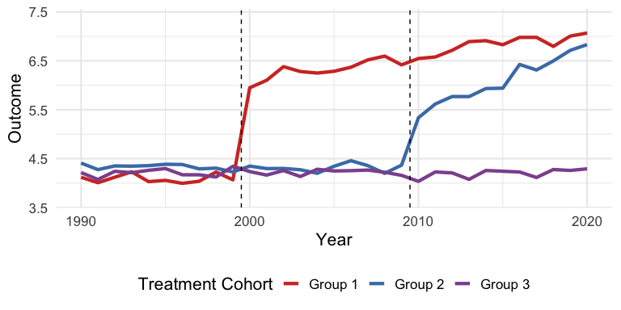
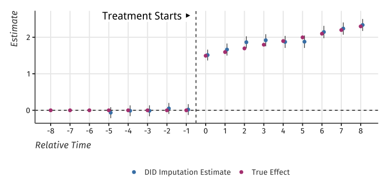
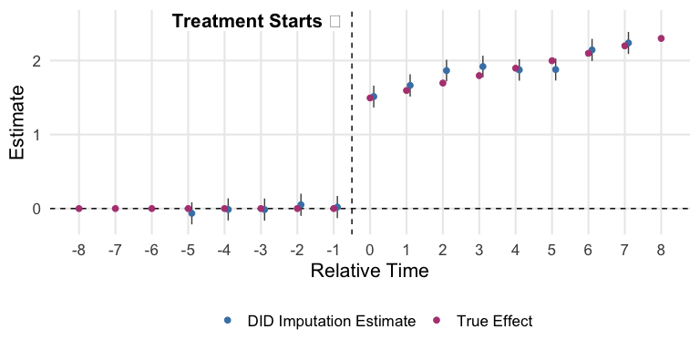

<!-- README.md is generated from README.Rmd. Please edit that file -->

# didimputation

<!-- badges: start -->
<!-- badges: end -->

The goal of didimputation is to estimate TWFE models without running
into the problem of staggered treatment adoption.

## Installation

You can install didimputation from github with:

``` r
devtools::install_github("kylebutts/didimputation")
```

### TWFE vs. DID Imputation Example

I will load example data from the package and plot the average outcome
among the groups. Here is one unit’s data:

``` r
library(didimputation)
#> Loading required package: fixest
#> Loading required package: data.table
library(fixest)
library(ggplot2)

# Load Data from did2s package
data("df_het", package = "didimputation")
setDT(df_het)
```

Here is a plot of the average outcome variable for each of the groups:

``` r
# Plot Data 
df_avg <- df_het[, 
  .(dep_var = mean(dep_var)), 
  by = .(group, year)
]

# Get treatment years for plotting
gs <- df_het[treat == TRUE, unique(g)]
    
ggplot() + 
    geom_line(data = df_avg, mapping = aes(y = dep_var, x = year, color = group), size = 1.5) +
    geom_vline(xintercept = gs - 0.5, linetype = "dashed") + 
    theme_minimal(base_size = 16) +
    theme(legend.position = "bottom") +
    labs(y = "Outcome", x = "Year", color = "Treatment Cohort") + 
    scale_y_continuous(expand = expansion(add = .5)) + 
    scale_color_manual(values = c("Group 1" = "#d2382c", "Group 2" = "#497eb3", "Group 3" = "#8e549f")) 
#> Warning: Using `size` aesthetic for lines was deprecated in ggplot2 3.4.0.
#> ℹ Please use `linewidth` instead.
```

<div class="figure">


<p class="caption">
Example data with heterogeneous treatment effects
</p>

</div>

### Estimate DID Imputation

First, lets estimate a static did:

``` r

# Static
static <- did_imputation(data = df_het, yname = "dep_var", gname = "g", tname = "year", idname = "unit")

static
#>      term estimate  std.error conf.low conf.high
#>    <char>    <num>      <num>    <num>     <num>
#> 1:  treat 2.262952 0.03139684 2.201414   2.32449
```

This is very close to the true treatment effect of 2.2384912.

Then, let’s estimate an event study did:

``` r

# Event Study
es <- did_imputation(data = df_het, yname = "dep_var", gname = "g",
               tname = "year", idname = "unit", 
               # event-study
               horizon=TRUE, pretrends = -5:-1)

es
#>       term    estimate  std.error    conf.low  conf.high
#>     <char>       <num>      <num>       <num>      <num>
#>  1:     -5 -0.06412085 0.07634962 -0.21376611 0.08552441
#>  2:     -4 -0.01201577 0.07634962 -0.16166103 0.13762949
#>  3:     -3 -0.01387197 0.07634962 -0.16351723 0.13577329
#>  4:     -2  0.05103140 0.07634962 -0.09861386 0.20067666
#>  5:     -1  0.02022464 0.07634962 -0.12942062 0.16986990
#>  6:      0  1.51314201 0.07547736  1.36520639 1.66107763
#>  7:      1  1.66384318 0.07675141  1.51341041 1.81427594
#>  8:      2  1.86436720 0.07450151  1.71834424 2.01039015
#>  9:      3  1.91872093 0.07471704  1.77227552 2.06516633
#> 10:      4  1.87322387 0.07418170  1.72782773 2.01862001
#> 11:      5  1.87844597 0.07567190  1.73012905 2.02676290
#> 12:      6  2.14373139 0.07632691  1.99413065 2.29333213
#> 13:      7  2.23777696 0.07610842  2.08860445 2.38694946
#> 14:      8  2.33650066 0.07446268  2.19055381 2.48244751
#> 15:      9  2.34352836 0.07471679  2.19708345 2.48997326
#> 16:     10  2.53443351 0.08109550  2.37548633 2.69338068
#> 17:     11  2.47944533 0.11953547  2.24515580 2.71373486
#> 18:     12  2.63493727 0.11531779  2.40891439 2.86096014
#> 19:     13  2.94449757 0.11047299  2.72797052 3.16102462
#> 20:     14  2.78171206 0.11466367  2.55697127 3.00645285
#> 21:     15  2.71470743 0.12030494  2.47890975 2.95050510
#> 22:     16  2.88065382 0.11563154  2.65401601 3.10729163
#> 23:     17  2.99383855 0.11438496  2.76964404 3.21803306
#> 24:     18  2.64616896 0.11545789  2.41987148 2.87246643
#> 25:     19  2.87530636 0.11405840  2.65175189 3.09886082
#> 26:     20  2.90465651 0.11320219  2.68278023 3.12653280
#>       term    estimate  std.error    conf.low  conf.high
```

And plot the results:

``` r

pts <- es |> 
  DT(, .(rel_year = term, estimate, std.error)) |>
  DT(, let(
    ci_lower = estimate - 1.96 * std.error,
    ci_upper = estimate + 1.96 * std.error,
    group = "DID Imputation Estimate",
    rel_year = as.numeric(rel_year)
  )) |>
  DT(, rel_year := rel_year + 0.1)

te_true <- df_het |>
    DT(
      g > 0, 
      .(estimate = mean(te + te_dynamic)), 
      by = "rel_year"
    ) |> 
    DT(, group := "True Effect")

pts <- rbind(pts, te_true, fill = TRUE)

pts = pts |>
  DT(rel_year >= -8 & rel_year <= 8, )

max_y <- max(pts$estimate)

ggplot() +
    # 0 effect
    geom_hline(yintercept = 0, linetype = "dashed") +
    geom_vline(xintercept = -0.5, linetype = "dashed") +
    # Confidence Intervals
    geom_linerange(data = pts, mapping = aes(x = rel_year, ymin = ci_lower, ymax = ci_upper), color = "grey30") +
    # Estimates
    geom_point(data = pts, mapping = aes(x = rel_year, y = estimate, color = group), size = 2) +
    # Label
    geom_label(data = data.frame(x = -0.5 - 0.1, y = max_y + 0.25, label = "Treatment Starts ▶"), label.size=NA,
               mapping = aes(x = x, y = y, label = label), size = 5.5, hjust = 1, fontface = 2, inherit.aes = FALSE) +
    scale_x_continuous(breaks = -8:8, minor_breaks = NULL) +
    scale_y_continuous(minor_breaks = NULL) +
    scale_color_manual(values = c("DID Imputation Estimate" = "steelblue", "True Effect" = "#b44682")) +
    labs(x = "Relative Time", y = "Estimate", color = NULL, title = NULL) +
    theme_minimal(base_size = 16) +
    theme(legend.position = "bottom")
#> Warning: Removed 17 rows containing missing values (`geom_segment()`).
```

<div class="figure">


<p class="caption">
Event-study plot with example data
</p>

</div>

### Comparison to TWFE

``` r

# TWFE
twfe <- fixest::feols(dep_var ~ i(rel_year, ref=c(-1, Inf)) | unit + year, data = df_het) 

twfe_est = broom::tidy(twfe)

twfe_est = twfe_est |> 
  DT(grepl(term, "rel_year::")) |>
  DT(, .(rel_year = term, estimate, std.error)) |> 
  DT(, let(
    rel_year = as.numeric(gsub("rel_year::", "", rel_year)),
    ci_lower = estimate - 1.96 * std.error,
    ci_upper = estimate + 1.96 * std.error,
    group = "TWFE Estimate"
  )) |>
  DT(rel_year <= 8 & rel_year >= -8, ) |> 
  DT(, rel_year := rel_year - 0.1)
#> Warning in grepl(term, "rel_year::"): argument 'pattern' has length > 1 and only
#> the first element will be used

#> Warning in grepl(term, "rel_year::"): argument 'pattern' has length > 1 and only
#> the first element will be used

#> Warning in grepl(term, "rel_year::"): argument 'pattern' has length > 1 and only
#> the first element will be used

#> Warning in grepl(term, "rel_year::"): argument 'pattern' has length > 1 and only
#> the first element will be used

#> Warning in grepl(term, "rel_year::"): argument 'pattern' has length > 1 and only
#> the first element will be used

#> Warning in grepl(term, "rel_year::"): argument 'pattern' has length > 1 and only
#> the first element will be used

#> Warning in grepl(term, "rel_year::"): argument 'pattern' has length > 1 and only
#> the first element will be used

#> Warning in grepl(term, "rel_year::"): argument 'pattern' has length > 1 and only
#> the first element will be used

#> Warning in grepl(term, "rel_year::"): argument 'pattern' has length > 1 and only
#> the first element will be used

#> Warning in grepl(term, "rel_year::"): argument 'pattern' has length > 1 and only
#> the first element will be used

#> Warning in grepl(term, "rel_year::"): argument 'pattern' has length > 1 and only
#> the first element will be used

#> Warning in grepl(term, "rel_year::"): argument 'pattern' has length > 1 and only
#> the first element will be used

#> Warning in grepl(term, "rel_year::"): argument 'pattern' has length > 1 and only
#> the first element will be used

#> Warning in grepl(term, "rel_year::"): argument 'pattern' has length > 1 and only
#> the first element will be used

#> Warning in grepl(term, "rel_year::"): argument 'pattern' has length > 1 and only
#> the first element will be used

#> Warning in grepl(term, "rel_year::"): argument 'pattern' has length > 1 and only
#> the first element will be used

# Add TWFE Points
both_pts <- rbind(pts, twfe_est, fill = TRUE)

max_y <- max(pts$estimate)

ggplot() +
    # 0 effect
    geom_hline(yintercept = 0, linetype = "dashed") +
    geom_vline(xintercept = -0.5, linetype = "dashed") +
    # Confidence Intervals
    geom_linerange(data = both_pts, mapping = aes(x = rel_year, ymin = ci_lower, ymax = ci_upper), color = "grey30") +
    # Estimates
    geom_point(data = both_pts, mapping = aes(x = rel_year, y = estimate, color = group), size = 2) +
    # Label
    geom_label(data = data.frame(x = -0.5 - 0.1, y = max_y + 0.25, label = "Treatment Starts ▶"), label.size=NA,
               mapping = aes(x = x, y = y, label = label), size = 5.5, hjust = 1, fontface = 2, inherit.aes = FALSE) +
    scale_x_continuous(breaks = -8:8, minor_breaks = NULL) +
    scale_y_continuous(minor_breaks = NULL) +
    scale_color_manual(values = c("DID Imputation Estimate" = "steelblue", "True Effect" = "#b44682", "TWFE Estimate" = "#82b446")) +
    labs(x = "Relative Time", y = "Estimate", color = NULL, title = NULL) +
    theme_minimal(base_size = 16) +
    theme(legend.position = "bottom")
#> Warning: Removed 17 rows containing missing values (`geom_segment()`).
```

<div class="figure">


<p class="caption">
TWFE and Two-Stage estimates of Event-Study
</p>

</div>
